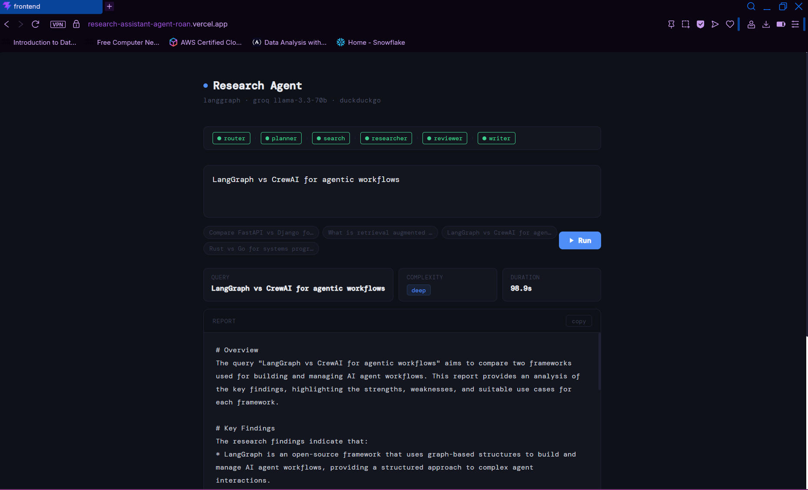
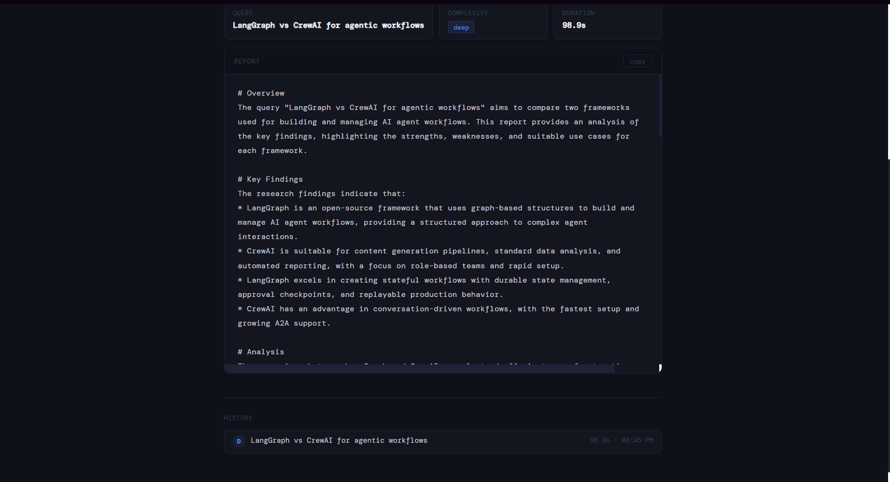

# Research Assistant Agent

A multi-agent research pipeline that takes a query, breaks it into search tasks, pulls live web results, analyzes them, self-reviews for gaps, and writes a structured report. Built with LangGraph and Groq, exposed via FastAPI, React frontend.

**Live Demo:** https://research-assistant-agent-roan.vercel.app

**API Docs:** https://research-assistant-agent-pw3h.onrender.com/docs

---


## Screenshots

### Home Page



### Generated Report



---


## Why I built this

Most research tools either do a single search or generate answers straight from an LLM's training data. I wanted to see what happens when you split the process into specialized agents — one that plans, one that searches, one that analyses, one that reviews, and one that writes — and wire them together with explicit state and routing. LangGraph made that structure easy to reason about and control.

---

## Agent flow

```
┌─────────┐
│ Router  │
└────┬────┘
     │
     ├── quick ──────────────► Writer
     │
     ▼
  Planner
     ▼
  Search
     ▼
  Researcher
     ▼
  Reviewer
     │
     ├── approved ──────────► Writer
     │
     └── feedback
              ▼
           Planner
```

**Router** classifies the query as `quick` or `deep`. Quick queries skip straight to the writer. Deep ones go through the full pipeline.

**Planner** breaks the query into focused search tasks. If the reviewer sends feedback, it only generates tasks for the missing parts — it won't redo what's already covered.

**Search** runs each task through DuckDuckGo and collects results.

**Researcher** reads each result set and extracts key facts, advantages, limitations, and unknowns. Strictly grounded in what was found — no invented claims.

**Reviewer** checks the combined findings. If something major is missing, it sends specific feedback back to the planner for another pass. Capped at one retry to avoid runaway loops.

**Writer** produces a markdown report with executive summary, key findings, analysis, conclusion, and sources.

---

## LangGraph concepts used

- State management
- Nodes and edges
- Conditional routing
- Tool calling
- Reflection loop
- Multi-agent orchestration

---

## Features

- Query routing — quick vs deep research
- Reflection and replanning loop
- Live web search via DuckDuckGo
- Structured report generation
- FastAPI backend
- React frontend
- Deployed on Render and Vercel

---

## Stack

- Python 3.12.8
- LangGraph
- Groq — LLaMA 3.3 70B
- DuckDuckGo Search
- FastAPI
- React + Vite

---

## Project structure

```
research-agent/
  backend/
    agents/
      __init__.py
      planner.py
      researcher.py
      reviewer.py
      router.py
      search.py
      writer.py
    config.py
    graph.py
    main.py
    state.py
    requirements.txt
    .env
  frontend/
    src/
      App.jsx
      ResearchAgent.jsx
    .env
    package.json
    vite.config.js
  .gitignore
  README.md
```

---

## Running locally

**Backend**

```bash
cd backend
python -m venv venv
venv\Scripts\activate
pip install -r requirements.txt
```

Create `backend/.env`:
```
GROQ_API_KEY=your_key_here
```

```bash
uvicorn main:app --reload
```

Runs at `http://localhost:8000`

**Frontend**

```bash
cd frontend
npm install
```

Create `frontend/.env`:
```
VITE_API_URL=http://localhost:8000
```

```bash
npm run dev
```

---

## API

```
POST /research
Content-Type: application/json

{ "query": "Compare FastAPI vs Django for production APIs" }
```

```json
{
  "query": "Compare FastAPI vs Django for production APIs",
  "complexity": "deep",
  "final_report": "..."
}
```

---

## Limitations

**Reflection loop** — deep queries can trigger 10–15 LLM calls total across planner, researcher, reviewer, and writer. If the reviewer isn't satisfied on the first pass, the whole research cycle runs again. Expect 1.5–2 minutes per deep query and heavy token usage. Not great when you're on a free tier key.

**Groq free tier** — rate limits apply. Running back-to-back deep queries will hit the limit fast. If you get a rate limit error, wait a minute and retry.

**DuckDuckGo search** — noticeably weaker than paid alternatives like Tavily. Results can be inconsistent depending on the query, which directly affects report quality since the researcher only works with what the search returns.

**Render free tier** — the backend spins down after inactivity. First request after idle takes around 30 seconds to respond.

---

## Deployment

Backend on Render, frontend on Vercel.

Render — root directory: `backend/`, start command: `uvicorn main:app --host 0.0.0.0 --port 8000`

Vercel — root directory: `frontend/`, env var: `VITE_API_URL=https://research-assistant-agent-pw3h.onrender.com`
